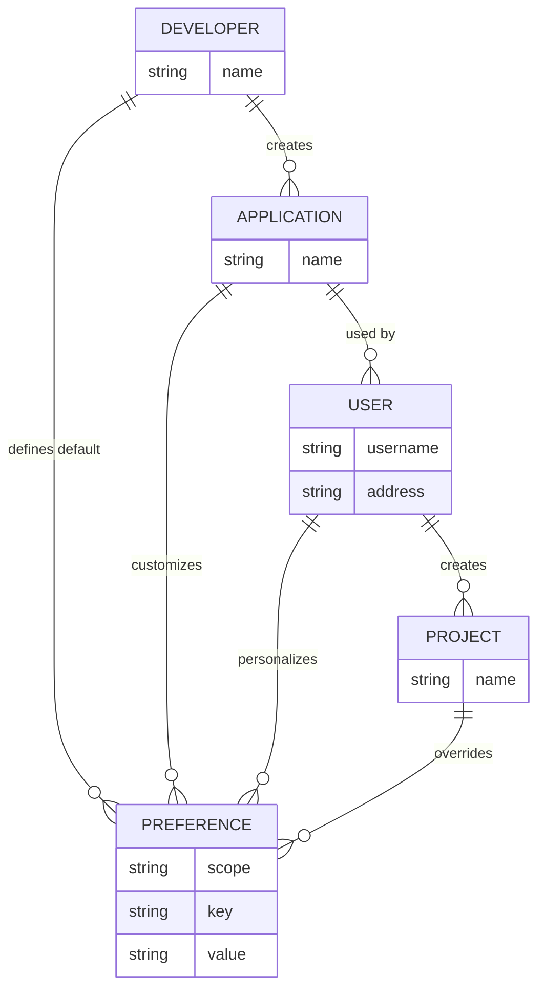

# Entity Relationships

```mermaid
erDiagram
    DEVELOPER {
        string name
    }

    APPLICATION {
        string name
    }

    USER {
        string username
        string address
    }

    PROJECT {
        string name
    }

    PREFERENCE {
        string scope
        string key
        string value
    }

    DEVELOPER ||--o{ APPLICATION : "creates"
    APPLICATION ||--o{ USER : "used by"
    USER ||--o{ PROJECT : "creates"

    DEVELOPER ||--o{ PREFERENCE : "defines default"
    APPLICATION ||--o{ PREFERENCE : "customizes"
    USER ||--o{ PREFERENCE : "personalizes"
    PROJECT ||--o{ PREFERENCE : "overrides"
```
