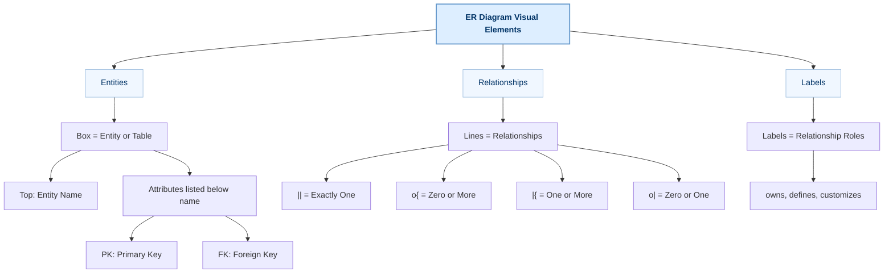

# What is an ER Diagram?

```mermaid
graph TD

%% Main Sections
Diagram[ER Diagram Visual Elements] --> Entities
Diagram --> Relationships
Diagram --> Labels

%% Entities Section
Entities --> EntityBox[Box = Entity or Table]
EntityBox --> EntityName[Top: Entity Name]
EntityBox --> Attributes[Attributes listed below name]
Attributes --> PK_Field["PK: Primary Key"]
Attributes --> FK_Field["FK: Foreign Key"]

%% Relationships Section
Relationships --> RelationLines[Lines = Relationships]
RelationLines --> ExactlyOne["|| = Exactly One"]
RelationLines --> ZeroOrMore["o{ = Zero or More"]
RelationLines --> OneOrMore["|{ = One or More"]
RelationLines --> ZeroOrOne["o| = Zero or One"]

%% Labels Section
Labels --> RelationLabels[Labels = Relationship Roles]
RelationLabels --> VerbExample["owns, defines, customizes"]

%% Styling
classDef main fill:#ddeeff,stroke:#6699cc,color:#003366,stroke-width:2px,font-weight:bold
classDef sub fill:#f0f7ff,stroke:#99bbdd,color:#003366,stroke-width:1px
class Diagram main
class Entities,Relationships,Labels sub
```
